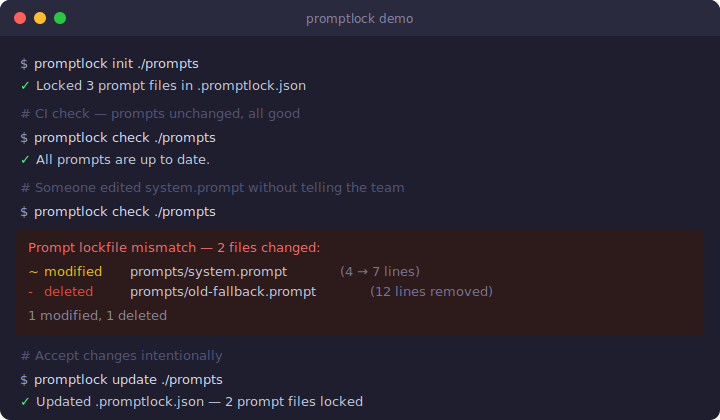

# promptlock

**Lock your LLM prompt files against accidental changes** — like `package-lock.json` for prompts.

`promptlock` computes SHA-256 hashes of your prompt files, stores them in `.promptlock.json`, and fails your CI pipeline if any prompt changes without a deliberate `promptlock update`. Prevents silent prompt drift from breaking production LLM behavior.



---

## Why

Prompt files are code. They change behavior. But unlike source code, prompt changes don't show up in type-checking, unit tests, or build failures — they slip through, quietly altering your LLM's behavior in production.

`promptlock` brings the same integrity guarantee you already trust for dependencies (`npm ci`) to your prompts.

---

## Install

```bash
npm install -g promptlock
```

Or use without installing:

```bash
npx promptlock init
```

---

## Quick start

```bash
# 1. Lock all .prompt files in your project (run once, commit .promptlock.json)
promptlock init ./prompts

# 2. Add to CI — fails with exit 1 if any prompt changed
promptlock check ./prompts

# 3. After intentional prompt edits, update the lock
promptlock update ./prompts
```

---

## Commands

| Command | Description |
|---------|-------------|
| `init [dir]` | Scan for prompt files, create `.promptlock.json` |
| `check [dir]` | Verify files match lock — **exits 1** if changed (use in CI) |
| `update [dir]` | Refresh lock after intentional edits |
| `status [dir]` | Show what changed without failing (alias: `diff`) |

### Options

| Flag | Description |
|------|-------------|
| `--ext .md` | Also track `.md` files (repeatable: `--ext .md --ext .txt`) |
| `--no-color` | Disable colored output |
| `-h, --help` | Show help |

By default `promptlock` tracks `*.prompt` files. Add `--ext .md` or `--ext .txt` to track other formats.

---

## CI example (GitHub Actions)

```yaml
- name: Check prompt integrity
  run: npx promptlock check ./prompts
```

If a prompt changed without a matching `.promptlock.json` update, the step fails:

```
  Prompt lockfile mismatch — 1 file changed:

  ~ modified  prompts/system.prompt (4 → 7 lines)

  Run `promptlock update` to accept these changes.
```

The developer must run `promptlock update`, review the diff, and commit the new `.promptlock.json` — making prompt changes explicit and reviewable in PRs.

---

## Programmatic API

```js
import { init, check, update, diffLocks, formatDiff } from 'promptlock'

// Initialize lock
const { count } = init('./prompts')

// Check — returns array of diff objects (empty = clean)
const diffs = check('./prompts')
if (diffs.length > 0) {
  console.log(formatDiff(diffs))
  process.exit(1)
}

// Update lock
update('./prompts', ['.prompt', '.md'])

// Low-level diff
const locked = { version: 1, entries: { 'a.prompt': { hash: 'abc...', lines: 5, chars: 120 } } }
const current = { version: 1, entries: { 'a.prompt': { hash: 'xyz...', lines: 7, chars: 150 } } }
const changes = diffLocks(locked, current)
// [{ file: 'a.prompt', type: 'modified', oldHash: 'abc...', newHash: 'xyz...', ... }]
```

---

## `.promptlock.json` format

```json
{
  "version": 1,
  "entries": {
    "prompts/system.prompt": {
      "hash": "e3b0c44298fc1c149afb4c8996fb92427ae41e4649b934ca495991b7852b855",
      "lines": 4,
      "chars": 120
    }
  }
}
```

Commit `.promptlock.json` alongside your prompts. Changes to it are visible in PR diffs, giving your team a clear audit trail of every prompt evolution.

---

## Support

If `promptlock` saved you from a bad prompt deploy, a tip is always welcome (optional):

**USDT on Ethereum (ERC-20):** `0xad39bdf2df0b8dd6991150fcea0a156150ed19b8`  
[Verify on Etherscan](https://etherscan.io/address/0xad39bdf2df0b8dd6991150fcea0a156150ed19b8)

> Send **only** on the Ethereum (ERC-20) network.

---

## License

MIT © 2026 Ayubjon
